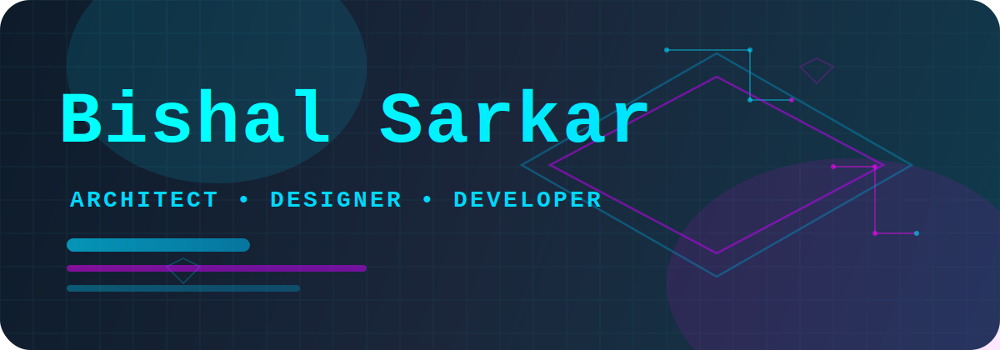
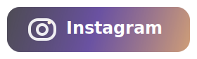

	

	<b>A passionate architect from India</b>

	
	
	

<table align="center">
	<tr>
		<td valign="top" width="50%">
			<h3 align="center">Connect with me</h3>
			

				
				 
				
			

		</td>
		<td valign="top" width="50%">
			<h3 align="center">Languages and Tools</h3>
			

				
				
				
				
			

		</td>
	</tr>
</table>
